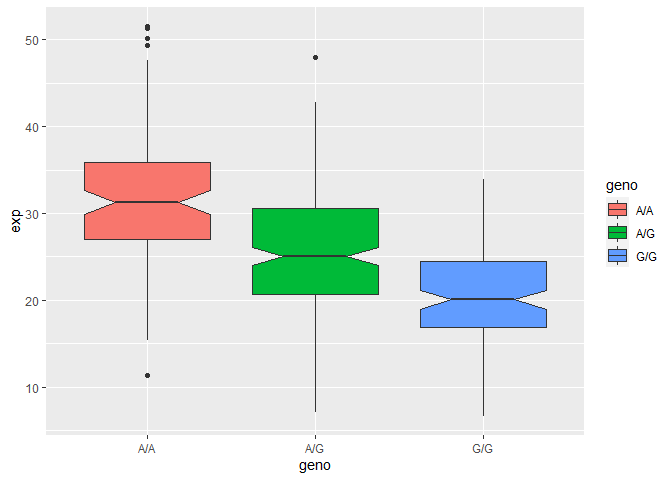

Lab 11
================
Nicholas Pacia

# Section 4 Population Scale Analysis

First download the file fromm
https://bioboot.github.io/bggn213_W19/class-material/rs8067378_ENSG00000172057.6.txt
into the project directory. Then read the file.

``` r
url <- "rs8067378_ENSG00000172057.6.txt"
data <- read.table(url)
head(data)
```

       sample geno      exp
    1 HG00367  A/G 28.96038
    2 NA20768  A/G 20.24449
    3 HG00361  A/A 31.32628
    4 HG00135  A/A 34.11169
    5 NA18870  G/G 18.25141
    6 NA11993  A/A 32.89721

> Q13 What is the sample size for each genotype and their median
> expression levels?

``` r
nrow(data) #total size of sample
```

    [1] 462

``` r
table(data$geno) #sample size of each genotype
```


    A/A A/G G/G 
    108 233 121 

``` r
#separating the genotypes into individual vectors to find median expression
aa <- data[data$geno == "A/A",]
ag <- data[data$geno == "A/G",]
gg <- data[data$geno == "G/G",]
```

``` r
#two different ways of getting median expression if already separated
median(aa$exp)
```

    [1] 31.24847

``` r
median(data[data$geno == "A/G", "exp"])
```

    [1] 25.06486

``` r
median(gg$exp)
```

    [1] 20.07363

``` r
library(ggplot2)
```

``` r
ggplot(data, aes(geno,exp, fill = geno)) +
  geom_boxplot(notch = T) 
```



> Q14 What could you infer from the realtive expression value between
> A/A and G/G displayed in this plot? does the SNP effect expression of
> ORMDL3

A/A has a higher expression than G/G so the G/G genotype has reduced
expression of this gene. Depending on the SNP, the expression of ORMDL3
changes; it is higher for A’s and lower for G’s.
