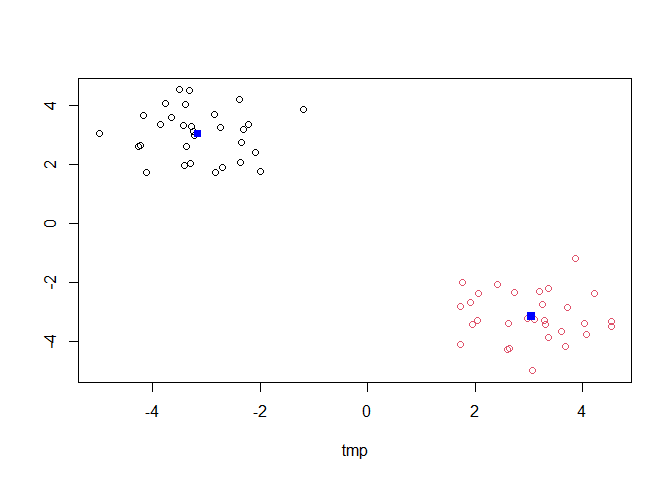
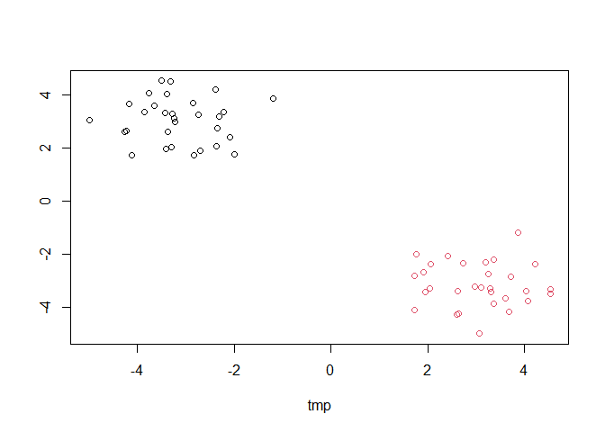
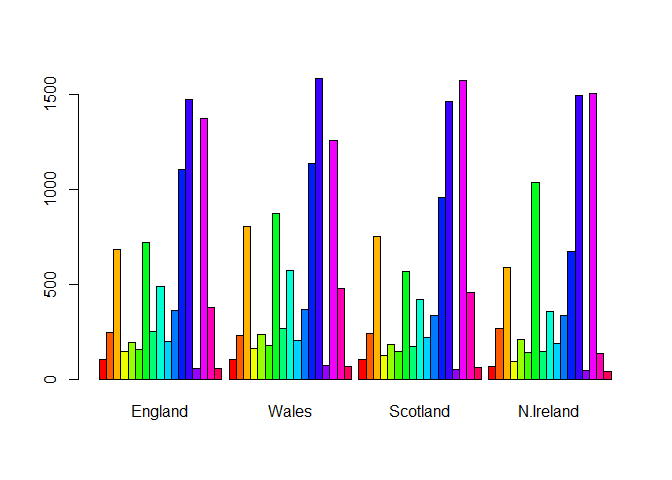
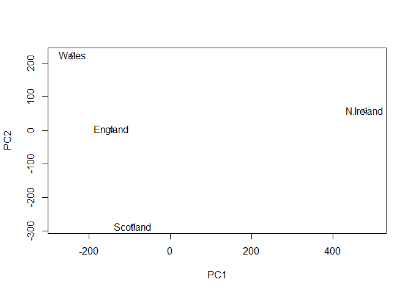

lab 7
================
Nicholas Pacia

# K-means Clustering

First we will test how this method works with made up data

``` r
x <- rnorm(10000)
hist(x)
```


numbers centered around -3

``` r
tmp <- c(rnorm(30, -3),
rnorm(30, +3))

x <- cbind(tmp,rev(tmp))
plot(x)
```


Now to see how `kmeans()` works with our sample data

``` r
km <- kmeans(x, 2, nstart = 20)
km
```

    K-means clustering with 2 clusters of sizes 30, 30

    Cluster means:
            tmp          
    1 -3.153084  3.050292
    2  3.050292 -3.153084

    Clustering vector:
     [1] 1 1 1 1 1 1 1 1 1 1 1 1 1 1 1 1 1 1 1 1 1 1 1 1 1 1 1 1 1 1 2 2 2 2 2 2 2 2
    [39] 2 2 2 2 2 2 2 2 2 2 2 2 2 2 2 2 2 2 2 2 2 2

    Within cluster sum of squares by cluster:
    [1] 40.32346 40.32346
     (between_SS / total_SS =  93.5 %)

    Available components:

    [1] "cluster"      "centers"      "totss"        "withinss"     "tot.withinss"
    [6] "betweenss"    "size"         "iter"         "ifault"      

``` r
km$centers
```

            tmp          
    1 -3.153084  3.050292
    2  3.050292 -3.153084

> Q. How many points are in each cluster? Q. What ‘component’ of your
> result object details -cluster assignment/membership? -cluster center?

``` r
km$size #returns number of points in the cluster
```

    [1] 30 30

``` r
km$cluster #returns the vector of assigned elements to each cluster
```

     [1] 1 1 1 1 1 1 1 1 1 1 1 1 1 1 1 1 1 1 1 1 1 1 1 1 1 1 1 1 1 1 2 2 2 2 2 2 2 2
    [39] 2 2 2 2 2 2 2 2 2 2 2 2 2 2 2 2 2 2 2 2 2 2

``` r
km$centers #returns the value of the center of cluster
```

            tmp          
    1 -3.153084  3.050292
    2  3.050292 -3.153084

> Q. Plot x colored by kmeans cluster assignment and add cluster centers
> as blue points

``` r
plot(x, col = km$cluster)
points(km$centers, col = "blue", pch = 15)
```



# Hierarchical Clustering

`hclust()` function in R performs hierarchical clustering. It requires
an input distance matrix, which can be from `dist()` function.

``` r
hc <- hclust(dist(x))
hc
```


    Call:
    hclust(d = dist(x))

    Cluster method   : complete 
    Distance         : euclidean 
    Number of objects: 60 

Plotting hclust objects with `plot()`.

``` r
plot(hc)
```


How to get cluster membership vector to cut the tree and yield seperate
branches with the leaves on each branch being clusters. `cutree()`
function

``` r
cutree(hc, h=8)
```

     [1] 1 1 1 1 1 1 1 1 1 1 1 1 1 1 1 1 1 1 1 1 1 1 1 1 1 1 1 1 1 1 2 2 2 2 2 2 2 2
    [39] 2 2 2 2 2 2 2 2 2 2 2 2 2 2 2 2 2 2 2 2 2 2

``` r
groups <- cutree(hc, k=2) #using cluster count
```

Plot data by hcluster groups.

``` r
plot(x, col = groups)
```



# Principal Component Analysis PCA

Grabbing data

``` r
url <- "https://tinyurl.com/UK-foods"
data <- read.csv(url)
```

Snippet of the data \>Q1. How many rows and columns are in your new data
frame named x? What R functions could you use to answer this questions?

``` r
dim(data) #gives rows and columns count
```

    [1] 17  5

``` r
head(data)
```

                   X England Wales Scotland N.Ireland
    1         Cheese     105   103      103        66
    2  Carcass_meat      245   227      242       267
    3    Other_meat      685   803      750       586
    4           Fish     147   160      122        93
    5 Fats_and_oils      193   235      184       209
    6         Sugars     156   175      147       139

Fix rownames. Can also be done when during
`read.csv("name", row.names = 1)`

``` r
rownames(data) <- data[,1]
data <- data[,-1]
head(data)
```

                   England Wales Scotland N.Ireland
    Cheese             105   103      103        66
    Carcass_meat       245   227      242       267
    Other_meat         685   803      750       586
    Fish               147   160      122        93
    Fats_and_oils      193   235      184       209
    Sugars             156   175      147       139

> Q2. Which approach to solving the ‘row-names problem’ mentioned above
> do you prefer and why? Is one approach more robust than another under
> certain circumstances?

I prefer setting rownames when reading the csv file because you can have
a typo or run multiple times, which will delete columns of data by
accident.

\##Plotting

``` r
barplot(as.matrix(data), beside=T, col=rainbow(nrow(data)))
```



> Q3: Changing what optional argument in the above barplot() function
> results in the following plot?

``` r
barplot(as.matrix(data), col = rainbow(nrow(data)))
```


> Q5: Generating all pairwise plots may help somewhat. Can you make
> sense of the following code and resulting figure? What does it mean if
> a given point lies on the diagonal for a given plot?

The table of charts shows which country is x and y axis as well as the
axis scale for each row and col on the outside. Points on the diagonal
show that they are similar or the same in value. Anything off the
diagonal shows that one country has more or less of that value.

``` r
pairs(data, col=rainbow(10), pch=16)
```


> Q6. What is the main differences between N. Ireland and the other
> countries of the UK in terms of this data-set?

N. Ireland has several outliers off of the diagonal when compared to the
other countries that the other countries of the UK don’t have when
compared to each other.

## PCA to the rescue

``` r
pca <- prcomp(t(data))
summary(pca)
```

    Importance of components:
                                PC1      PC2      PC3       PC4
    Standard deviation     324.1502 212.7478 73.87622 4.189e-14
    Proportion of Variance   0.6744   0.2905  0.03503 0.000e+00
    Cumulative Proportion    0.6744   0.9650  1.00000 1.000e+00

Table shows PC1 covers 67% of variation and PC2 covers 29%, but together
they cover 97% of variation.

> Q7. Complete the code below to generate a plot of PC1 vs PC2. The
> second line adds text labels over the data points.

``` r
plot(pca$x[,1], pca$x[,2], xlab = "PC1", ylab = "PC2", xlim = c(-270, 500))
text(pca$x[,1], pca$x[,2], colnames(data))
```



> Q8. Customize your plot so that the colors of the country names match
> the colors in our UK and Ireland map and table at start of this
> document.

``` r
plot(pca$x[,1], pca$x[,2], xlab = "PC1", ylab = "PC2", xlim = c(-270, 500))
text(pca$x[,1], pca$x[,2], colnames(data), col = c("orange", "red", "blue", "darkgreen"))
```


> Q9: Generate a similar ‘loadings plot’ for PC2. What two food groups
> feature prominantely and what does PC2 maninly tell us about?

``` r
par(mar=c(10, 3, 0.35, 0))
barplot( pca$rotation[,2], las=2 )
```


PC2 features fresh potatoes and soft drinks most predominantly. It shows
a large difference between fresh potatoes and soft drinks, which
captures the spread of the values (PC2) off of the best fit line (PC1)

# PCA of RNA-seq data

initialize data

``` r
url2 <- "https://tinyurl.com/expression-CSV"
rna.data <- read.csv(url2, row.names=1)
head(rna.data)
```

           wt1 wt2  wt3  wt4 wt5 ko1 ko2 ko3 ko4 ko5
    gene1  439 458  408  429 420  90  88  86  90  93
    gene2  219 200  204  210 187 427 423 434 433 426
    gene3 1006 989 1030 1017 973 252 237 238 226 210
    gene4  783 792  829  856 760 849 856 835 885 894
    gene5  181 249  204  244 225 277 305 272 270 279
    gene6  460 502  491  491 493 612 594 577 618 638

> Q10: How many genes and samples are in this data set?

``` r
dim(rna.data)
```

    [1] 100  10

100 genes and 10 samples

Scatterplot of data

``` r
## Again we have to take the transpose of our data 
pca <- prcomp(t(rna.data), scale=TRUE)
 
## Simple un polished plot of pc1 and pc2
plot(pca$x[,1], pca$x[,2], xlab="PC1", ylab="PC2")
```


``` r
summary(pca)
```

    Importance of components:
                              PC1    PC2     PC3     PC4     PC5     PC6     PC7
    Standard deviation     9.6237 1.5198 1.05787 1.05203 0.88062 0.82545 0.80111
    Proportion of Variance 0.9262 0.0231 0.01119 0.01107 0.00775 0.00681 0.00642
    Cumulative Proportion  0.9262 0.9493 0.96045 0.97152 0.97928 0.98609 0.99251
                               PC8     PC9      PC10
    Standard deviation     0.62065 0.60342 3.348e-15
    Proportion of Variance 0.00385 0.00364 0.000e+00
    Cumulative Proportion  0.99636 1.00000 1.000e+00

Barplot of summary

``` r
plot(pca, main="Quick scree plot")
```


Data to generate own scree plot

``` r
## Variance captured per PC 
pca.var <- pca$sdev^2

## Percent variance is often more informative to look at 
pca.var.per <- round(pca.var/sum(pca.var)*100, 1)
pca.var.per
```

     [1] 92.6  2.3  1.1  1.1  0.8  0.7  0.6  0.4  0.4  0.0

Generate scree-plot

``` r
barplot(pca.var.per, main="Scree Plot", 
        names.arg = paste0("PC", 1:10),
        xlab="Principal Component", ylab="Percent Variation")
```


Pretty main PCA plot

``` r
## A vector of colors for wt and ko samples
colvec <- colnames(rna.data)
colvec[grep("wt", colvec)] <- "red"
colvec[grep("ko", colvec)] <- "blue"

plot(pca$x[,1], pca$x[,2], col=colvec, pch=16,
     xlab=paste0("PC1 (", pca.var.per[1], "%)"),
     ylab=paste0("PC2 (", pca.var.per[2], "%)"))

text(pca$x[,1], pca$x[,2], labels = colnames(rna.data), pos=c(rep(4,5), rep(2,5)))
```


