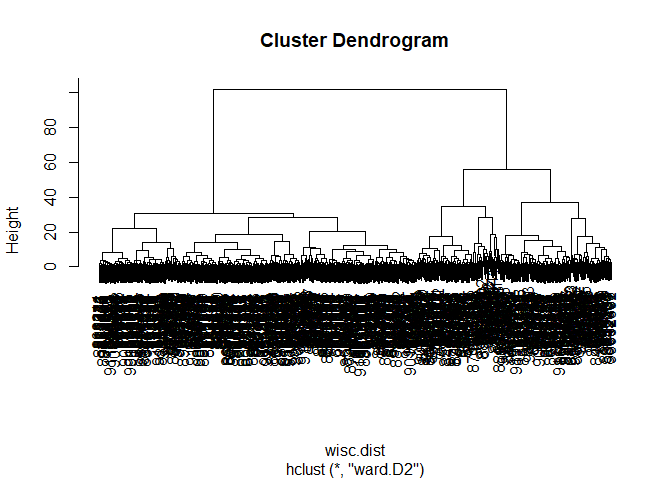

Lab 8
================
Nicholas Pacia

Gathering data

``` r
fna.data <- "WisconsinCancer.csv"
wsd.df <- read.csv(fna.data, row.names = 1)
```

``` r
#head(wsd.df)
```

``` r
wsc.data <- wsd.df[,-1]
diagnosis <- as.factor(wsd.df[,1])
```

> For wsc.data and diagnosis:

> Q1. How many observations are in this dataset?

> Q2. How many of the observations have a malignant diagnosis?

> Q3. How many variables/features in the data are suffixed with \_mean?

``` r
nrow(wsc.data) #number of observations
```

    [1] 569

``` r
sum(diagnosis=="M") #number of malignant diagnoses
```

    [1] 212

``` r
length(grep("_mean", colnames(wsc.data))) #number of variables with the suffix _mean
```

    [1] 10

# Starting PCA

``` r
# Check column means and standard deviations
colMeans(wsc.data)
```

                radius_mean            texture_mean          perimeter_mean 
               1.412729e+01            1.928965e+01            9.196903e+01 
                  area_mean         smoothness_mean        compactness_mean 
               6.548891e+02            9.636028e-02            1.043410e-01 
             concavity_mean     concave.points_mean           symmetry_mean 
               8.879932e-02            4.891915e-02            1.811619e-01 
     fractal_dimension_mean               radius_se              texture_se 
               6.279761e-02            4.051721e-01            1.216853e+00 
               perimeter_se                 area_se           smoothness_se 
               2.866059e+00            4.033708e+01            7.040979e-03 
             compactness_se            concavity_se       concave.points_se 
               2.547814e-02            3.189372e-02            1.179614e-02 
                symmetry_se    fractal_dimension_se            radius_worst 
               2.054230e-02            3.794904e-03            1.626919e+01 
              texture_worst         perimeter_worst              area_worst 
               2.567722e+01            1.072612e+02            8.805831e+02 
           smoothness_worst       compactness_worst         concavity_worst 
               1.323686e-01            2.542650e-01            2.721885e-01 
       concave.points_worst          symmetry_worst fractal_dimension_worst 
               1.146062e-01            2.900756e-01            8.394582e-02 

``` r
apply(wsc.data,2,sd)
```

                radius_mean            texture_mean          perimeter_mean 
               3.524049e+00            4.301036e+00            2.429898e+01 
                  area_mean         smoothness_mean        compactness_mean 
               3.519141e+02            1.406413e-02            5.281276e-02 
             concavity_mean     concave.points_mean           symmetry_mean 
               7.971981e-02            3.880284e-02            2.741428e-02 
     fractal_dimension_mean               radius_se              texture_se 
               7.060363e-03            2.773127e-01            5.516484e-01 
               perimeter_se                 area_se           smoothness_se 
               2.021855e+00            4.549101e+01            3.002518e-03 
             compactness_se            concavity_se       concave.points_se 
               1.790818e-02            3.018606e-02            6.170285e-03 
                symmetry_se    fractal_dimension_se            radius_worst 
               8.266372e-03            2.646071e-03            4.833242e+00 
              texture_worst         perimeter_worst              area_worst 
               6.146258e+00            3.360254e+01            5.693570e+02 
           smoothness_worst       compactness_worst         concavity_worst 
               2.283243e-02            1.573365e-01            2.086243e-01 
       concave.points_worst          symmetry_worst fractal_dimension_worst 
               6.573234e-02            6.186747e-02            1.806127e-02 

Creating PCA

``` r
wsc.pr <- prcomp(wsc.data, scale = T)
summary(wsc.pr)
```

    Importance of components:
                              PC1    PC2     PC3     PC4     PC5     PC6     PC7
    Standard deviation     3.6444 2.3857 1.67867 1.40735 1.28403 1.09880 0.82172
    Proportion of Variance 0.4427 0.1897 0.09393 0.06602 0.05496 0.04025 0.02251
    Cumulative Proportion  0.4427 0.6324 0.72636 0.79239 0.84734 0.88759 0.91010
                               PC8    PC9    PC10   PC11    PC12    PC13    PC14
    Standard deviation     0.69037 0.6457 0.59219 0.5421 0.51104 0.49128 0.39624
    Proportion of Variance 0.01589 0.0139 0.01169 0.0098 0.00871 0.00805 0.00523
    Cumulative Proportion  0.92598 0.9399 0.95157 0.9614 0.97007 0.97812 0.98335
                              PC15    PC16    PC17    PC18    PC19    PC20   PC21
    Standard deviation     0.30681 0.28260 0.24372 0.22939 0.22244 0.17652 0.1731
    Proportion of Variance 0.00314 0.00266 0.00198 0.00175 0.00165 0.00104 0.0010
    Cumulative Proportion  0.98649 0.98915 0.99113 0.99288 0.99453 0.99557 0.9966
                              PC22    PC23   PC24    PC25    PC26    PC27    PC28
    Standard deviation     0.16565 0.15602 0.1344 0.12442 0.09043 0.08307 0.03987
    Proportion of Variance 0.00091 0.00081 0.0006 0.00052 0.00027 0.00023 0.00005
    Cumulative Proportion  0.99749 0.99830 0.9989 0.99942 0.99969 0.99992 0.99997
                              PC29    PC30
    Standard deviation     0.02736 0.01153
    Proportion of Variance 0.00002 0.00000
    Cumulative Proportion  1.00000 1.00000

> Q4. From your results, what proportion of the original variance is
> captured by the first principal components (PC1)?

PC1 captures 44.3% of original variance.

> Q5. How many principal components (PCs) are required to describe at
> least 70% of the original variance in the data?

3 PCs are required for at least 70% cumulative proportion of variance

> Q6. How many principal components (PCs) are required to describe at
> least 90% of the original variance in the data?

For 90%, 7 PCs are required to account for original variance.

Plot the PCA

``` r
biplot(wsc.pr)
```


> Q7. What stands out to you about this plot? Is it easy or difficult to
> understand? Why?

Nothing stands out because this plot is impossible to understand. All
the labeled observations and variables overlap and become unreadable.

Prettier plot

``` r
plot( wsc.pr$x, col = diagnosis , 
     xlab = "PC1", ylab = "PC2")
```


Same thing but for PC1 and PC3

``` r
plot(wsc.pr$x[,c(1,3)], col = diagnosis, 
     xlab = "PC1", ylab = "PC3")
```


> Q8. What do you notice about these plots?

There is a clearer divide between benign and malignant cases in the PC2
vs PC1 plot compared to PC3 vs PC1. The PC3 vs PC1 plot has more
malignant and benign cases overlapping over the same area, which would
make it harder for that plot to be used to diagnose a patient. PC3
covers less variance than PC2.

Fancy ggplot

``` r
library(ggplot2) #bring in ggplot package

df <- as.data.frame(wsc.pr$x)
df$diagnosis <- diagnosis


ggplot(df) + 
  aes(PC1, PC2, col=diagnosis) + 
  geom_point()
```


## Variance explained

Calculate variance of each component

``` r
pr.var <- wsc.pr$sdev^2
head(pr.var)
```

    [1] 13.281608  5.691355  2.817949  1.980640  1.648731  1.207357

``` r
pve <- pr.var / sum(pr.var)

# Plot variance explained for each principal component
plot(pve, xlab = "Principal Component", 
     ylab = "Proportion of Variance Explained", 
     ylim = c(0, 1), type = "o")
```


``` r
# Alternative scree plot of the same data, note data driven y-axis
barplot(pve, ylab = "Precent of Variance Explained",
     names.arg=paste0("PC",1:length(pve)), las=2, axes = FALSE)
axis(2, at=pve, labels=round(pve,2)*100 )
```


> Q9. For the first principal component, what is the component of the
> loading vector (i.e. wisc.pr\$rotation\[,1\]) for the feature
> concave.points_mean? Q10. What is the minimum number of principal
> components required to explain 80% of the variance of the data?

``` r
wsc.pr$rotation["concave.points_mean",1] #prints the component of rotation vector for concave.points_mean
```

    [1] -0.2608538

``` r
y <- summary(wsc.pr)
attributes(y)
```

    $names
    [1] "sdev"       "rotation"   "center"     "scale"      "x"         
    [6] "importance"

    $class
    [1] "summary.prcomp"

``` r
sum(y$importance[3,] <= 0.8)+1 #number of PCs required to cover more than 80% variation
```

    [1] 5

## Clustering PCA

Figuring out how many PCS i need for at least 90%

``` r
wsc.summary <- summary(wsc.pr)
attributes(wsc.summary)
```

    $names
    [1] "sdev"       "rotation"   "center"     "scale"      "x"         
    [6] "importance"

    $class
    [1] "summary.prcomp"

``` r
sum(wsc.summary$importance[3,] <= 0.9) + 1
```

    [1] 7

Forming clusters. `hclust()` requires a distance matrix input

``` r
wisc.dist <- dist(wsc.pr$x[,1:7])
wisc.pr.hclust <- hclust(wisc.dist, method = "ward.D2")
plot(wisc.pr.hclust)
```



``` r
grps <- cutree(wisc.pr.hclust, k=2)
table(grps)
```

    grps
      1   2 
    216 353 

``` r
table(diagnosis, grps)
```

             grps
    diagnosis   1   2
            B  28 329
            M 188  24

Plot based off of these groups

``` r
plot(wsc.pr$x[,1:2], col=grps)
```


## Hierarchical clustering

``` r
data.scaled <- scale(wsc.data)
data.dist <- dist(data.scaled)
wisc.hclust <- hclust(data.dist)
```

> Q11. Using the plot() and abline() functions, what is the height at
> which the clustering model has 4 clusters?

``` r
plot(wisc.hclust)
abline(h = 19, col="red", lty=2) #height 19 for 4 clusters
```


``` r
wisc.hclust.clusters <- cutree(wisc.hclust, k =6)
table(wisc.hclust.clusters, diagnosis)
```

                        diagnosis
    wisc.hclust.clusters   B   M
                       1  12 165
                       2   0   5
                       3 331  39
                       4   2   0
                       5  12   1
                       6   0   2

> Q12. Can you find a better cluster vs diagnoses match by cutting into
> a different number of clusters between 2 and 10?

Separating into 6 clusters ends up with the best division of B and M so
that most clusters have almost all M or mostly B with as little
overlapping B and M in the same cluster. Adding more clusters will not
improve the separation of clusters 1 and 3.

> Q13. Which method gives your favorite results for the same data.dist
> dataset? Explain your reasoning.

``` r
wisc.hclust <- hclust(data.dist, method = "ward.D2")
plot(wisc.hclust)
```


I prefer ward.D2 method because it create 2 clear clusters to best
represent the 2 diagnosis options. It is also organized the best to show
2 clear brackets for these clusters.

``` r
grps <- cutree(wisc.pr.hclust, k=4)
table(grps)
```

    grps
      1   2   3   4 
     45  79  92 353 

``` r
table(diagnosis, grps)
```

             grps
    diagnosis   1   2   3   4
            B   0   2  26 329
            M  45  77  66  24

> Q15. How well does the newly created model with four clusters separate
> out the two diagnoses?

This new model is worse because now there are ore clusters that have
less diagnostic clarity since cluster 3 has more proportional B
diagnoses than before when there were 2 clusters, so anything that falls
into cluster 3 is more likely to be falsely classified.

> Q17. Which of your analysis procedures resulted in a clustering model
> with the best specificity? How about sensitivity?

The combining method with clustering from the PCA resulted in the best
clustering model with the best specificity and sensitivity compared to
the normal hierarchical cluster that we performed.

> Q18. Which of these new patients should we prioritize for follow up
> based on your results?

Patient 1 should
