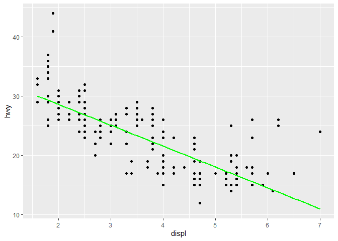
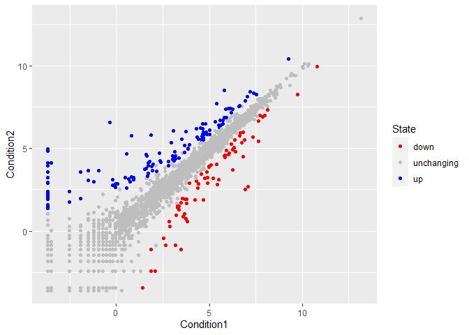
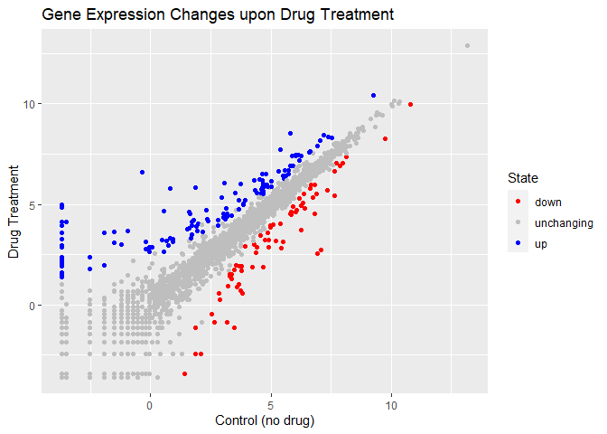

Class 05: Data Visualization with GGPLOT
================
Nicholas Pacia

\#Our first ggplot ggplot2 package must be downloaded to computer first

To install any package we use the `install.packages()` command.

Now can I use it? No, we must first call `library(ggplot2)`

``` r
library(ggplot2)
```

``` r
head(mpg)
```

    # A tibble: 6 × 11
      manufacturer model displ  year   cyl trans      drv     cty   hwy fl    class 
      <chr>        <chr> <dbl> <int> <int> <chr>      <chr> <int> <int> <chr> <chr> 
    1 audi         a4      1.8  1999     4 auto(l5)   f        18    29 p     compa…
    2 audi         a4      1.8  1999     4 manual(m5) f        21    29 p     compa…
    3 audi         a4      2    2008     4 manual(m6) f        20    31 p     compa…
    4 audi         a4      2    2008     4 auto(av)   f        21    30 p     compa…
    5 audi         a4      2.8  1999     6 auto(l5)   f        16    26 p     compa…
    6 audi         a4      2.8  1999     6 manual(m5) f        18    26 p     compa…

First plot of displ vs hwy. All ggplot graphs are made in the same way
(data+aes+geom)

``` r
ggplot(mpg) + aes(displ,hwy) + geom_point()
```


Adding more layers

``` r
ggplot(mpg) + aes(displ,hwy) + geom_point() +
  geom_smooth(method="lm",se=F, color="green")
```

    `geom_smooth()` using formula 'y ~ x'



\#Plot of gene expression data First read the data from online

``` r
url <- "https://bioboot.github.io/bimm143_S20/class-material/up_down_expression.txt"
genes <- read.delim(url)
head(genes)
```

            Gene Condition1 Condition2      State
    1      A4GNT -3.6808610 -3.4401355 unchanging
    2       AAAS  4.5479580  4.3864126 unchanging
    3      AASDH  3.7190695  3.4787276 unchanging
    4       AATF  5.0784720  5.0151916 unchanging
    5       AATK  0.4711421  0.5598642 unchanging
    6 AB015752.4 -3.6808610 -3.5921390 unchanging

> Q. How many genes are in this dataset?

``` r
nrow(genes)
```

    [1] 5196

What are column names?

``` r
colnames(genes)
```

    [1] "Gene"       "Condition1" "Condition2" "State"     

``` r
ggplot(genes, aes(Condition1,Condition2)) +geom_point()
```


Adding colors: add another aes() mapping of color to the `State` column.

``` r
ggplot(genes, aes(Condition1,Condition2, color=State)) +geom_point()
```


> Q. How many genes are up regulaed and down regulated?

``` r
table(genes$State)
```


          down unchanging         up 
            72       4997        127 

More customization of plot. Plot saved to object `n`. Use
`scale_color_manual` to manually set color values. We can then update
our object with the new changes so that they are saved for future plots.

``` r
n <- ggplot(genes, aes(Condition1,Condition2, color=State)) +geom_point()
n <- n + scale_color_manual(values = c("red", "grey", "blue"))
n
```



Now we need to add titles and descriptors with `labs()`.

``` r
n <- n + labs(title = "Gene Expression Changes upon Drug Treatment",
           x="Control (no drug)", y="Drug Treatment")
n
```


